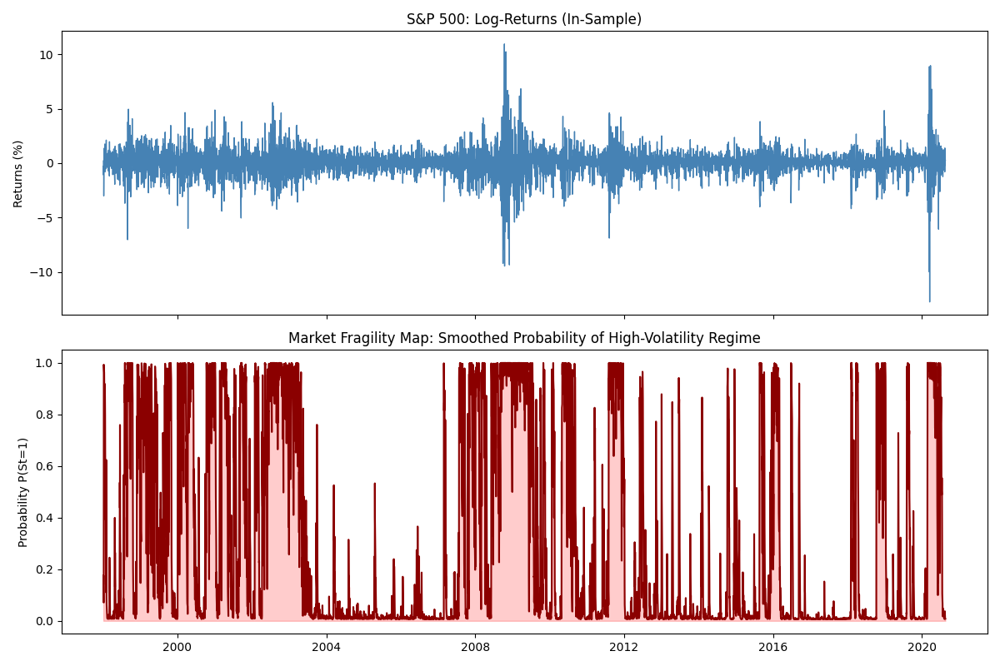
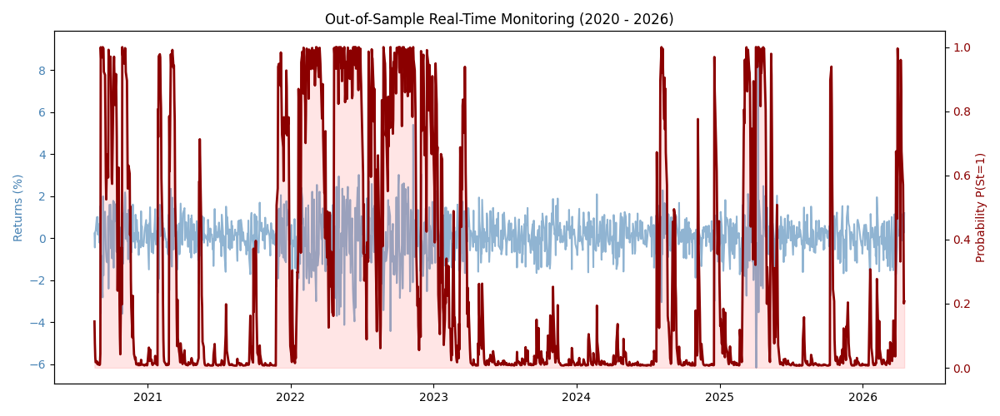

# S&P 500 Market Fragility Map: A Hamilton Filter Approach

This repository contains the Python implementation of the **Hamilton Regime-Switching Filter** applied to the S&P 500 (1998-2026). This research focuses on the transition between stable growth and crisis regimes, providing a real-time "Fragility Map" for risk management.

## Key Concepts
Financial markets are non-linear. Classical models (like ARMA) often "average out" market behavior, failing to capture abrupt structural shifts. This project addresses the **Spurious Persistence** of volatility by identifying two distinct states:
- **Regime 0 (Stable):** Low variance ($\sigma^2 \approx 0.5$).
- **Regime 1 (Crisis):** High variance ($\sigma^2 \approx 3.8$).

## Empirical Evidence

### In-Sample Fragility Map
The following chart shows how the model identifies historical regimes of instability, distinguishing between the "Bull" state and the "Crisis" state.

### Out-of-Sample Real-Time Monitoring
The model acts as a "probabilistic radar," updating as new observations arrive. Below is the performance during the post-2020 era, showing the spikes in crisis probability during inflationary shocks and geopolitical tensions.

## Performance Metrics
The Hamilton Filter provides superior diagnostic power compared to linear benchmarks:

| Model | RMSE | MAE |
| :--- | :--- | :--- |
| **Hamilton Filter** | **1.0608** | **0.7569** |
| ARMA(1,1) Benchmark | 1.0647 | 0.7623 |

## Key Features
- **Robust Statistical Inference:** The implementation utilizes Quasi-Maximum Likelihood (QML) with Sandwich Covariance Estimators. This ensures that the significance tests for regime transitions are robust to the fat-tailed nature of financial returns, avoiding the over-optimistic p-values common in standard Maximum Likelihood estimations.
- **Adaptive Risk Management:** A Composite VaR formula that "jumps" based on filtered probabilities.
- **Dynamic Hedging:** A threshold-based signal ($P > 0.5$) for de-risking portfolios during structural breaks.
- **Python Implementation:** Modular code using `statsmodels` for Markov Regression.

## Tech Stack
- Python 3.x (`pandas`, `numpy`, `statsmodels`, `matplotlib`)
